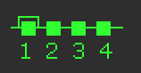
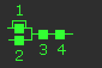
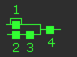
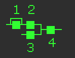
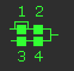
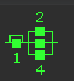
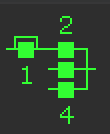
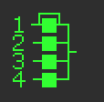

|CC# |Algorithm|CC Values|
|---|---|---|---|
|Algorithm01|  |00|
|Algorithm02|  |00|
|Algorithm03|  |00|
|Algorithm04|  |00|
|Algorithm05|  |00|
|Algorithm06|  |00|
|Algorithm07|  |00|
|Algorithm08|  |00|
